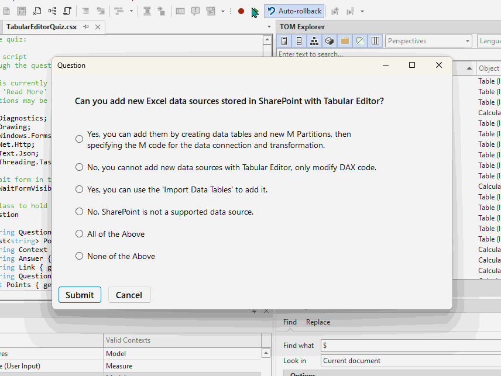

# TabularEditorQuiz
A quiz for learning Tabular Editor.

## To Play the Quiz
1. Download the TabularEditorQuiz.csx or copy the C# code
2. Execute the script in the Tabular Editor 3 'C# Script' window

## Notes & Limitations:
- This script is not an official product nor endorsed by any official entity.
- This was a fun project to try and make an educational Tabular Editor quiz in a weekend.
- The script is provided as-is without warranty or guarantees. It has not been tested on Tabular Editor 2.

_This was thrown together in a weekend as a small, fun and potentially helpful resource._